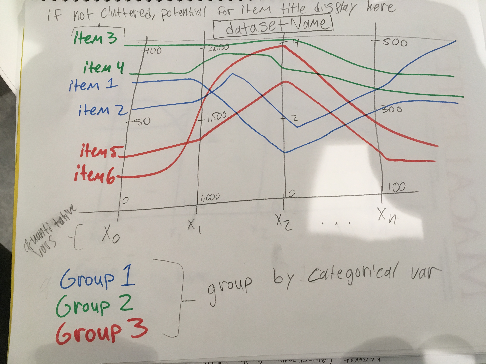
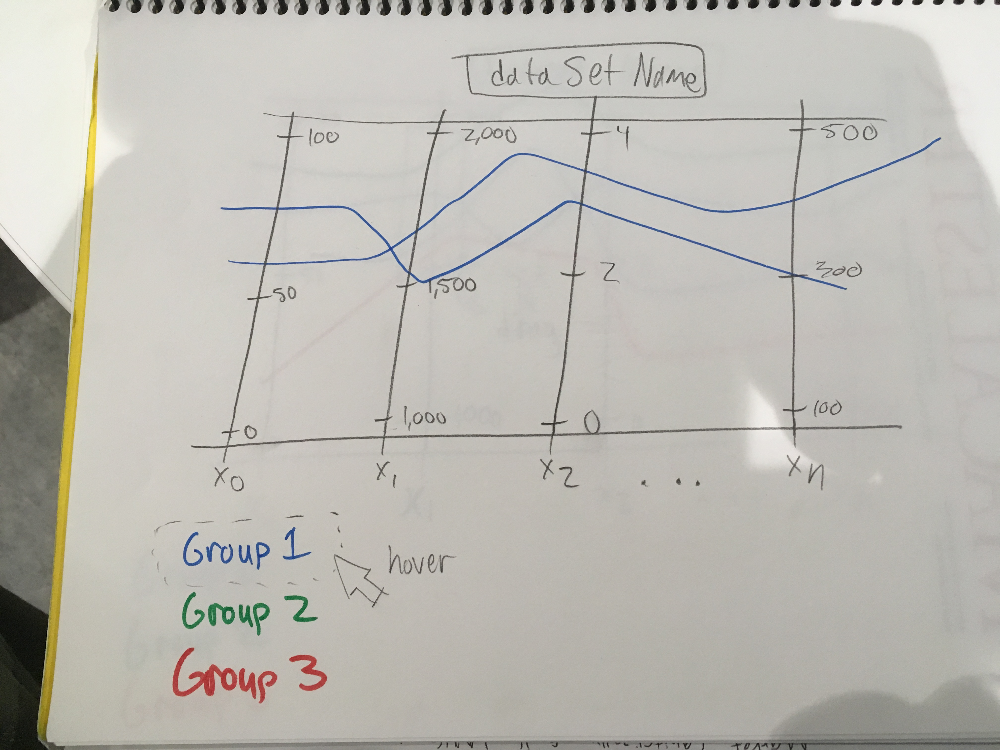
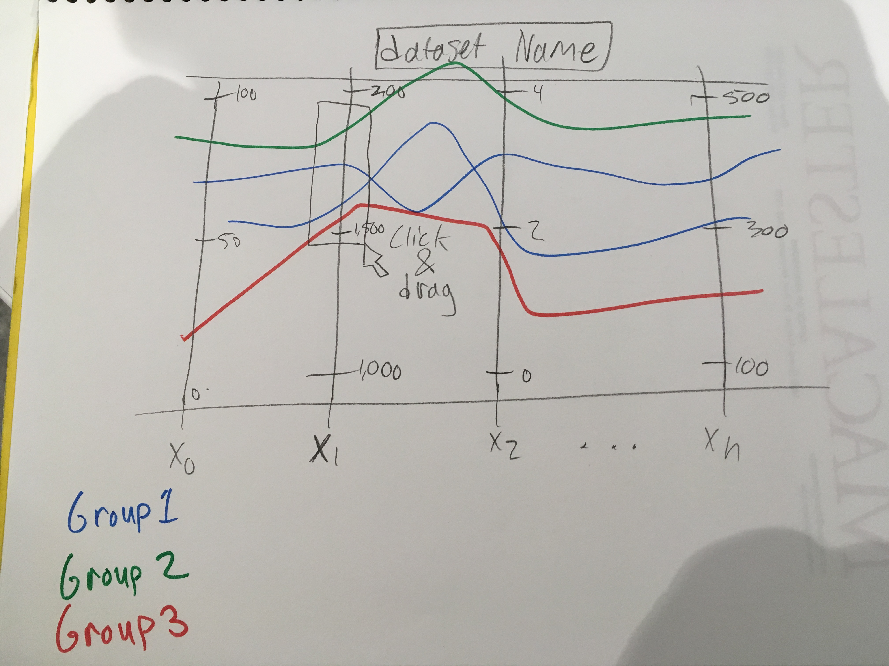

# Parallel-Coordinates
Matt Hagen & Steven Roach
Parallel Coordinates Data Visualization

We initially drew up a static visualization with the idea of grouping items by a categorical variable, and assigning each group a unique color.  
Without any interactions we wanted the user to get an idea of the breadth of the data and categories.  

In designing interactions for filtering, we wanted the ability to filter by quantitative values as well as category.  
We did this by implementing a hover interactions that allows the user to filter out all but a single category.

We also implemented a click and drag function so that users could filter a specific range of quantitative values in a given attribute axis.  

We also came up with the idea of including item names as a table in the lower right section of our visualization, ordered by some selected attribute x. We decided that should be a later design feature, and kept playing with the idea as the visualization continued to develop.  

During the static implementation we realized our design was somewhat cluttered and opted to stagger our axis labels and eliminate intermediate axis values.
Once we were able to accomplish these primary interactions, we wanted to be able to rearrange our axes.  To do this we added a grabbable button to the unused space between staggered axis titles.

In developing the interactions we knew we also needed to be smart with our architecture design and created several classes for different aspects of the design.
An Axis class holds code for visualizing and moving the axes and a QuantFilter class specifically to handle the click and drag filtering code.  A Group class holds a HashMap for a category key and color value, and also handles hover interactions. 
An Item class then holds onto all the data for a given row and a category label which corresponds to a Group hashmap key for easy color pairing.
A Line class contains an Item and handles the visual component of the plotted axes positions as given by the Item data.
